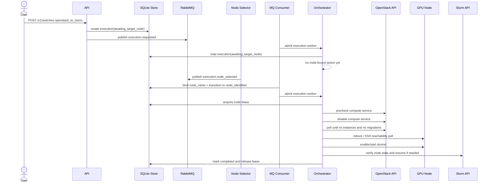

# OpenStack to Slurm 現況流程（MQ-driven admission 版）

本文件整理目前 repo 內已落地的 `openstack_to_slurm` 執行流程。重點是描述 2026-05-28 之後程式碼的實際行為: request 先被 API 接受並持久化，再透過 RabbitMQ event 驅動 admission；daemon 不再靠全域 store tick 掃描 active executions 來發現新工作。

## 範圍

這裡描述的是使用者呼叫 API 之後，daemon 如何把一台目前屬於 OpenStack 的 GPU 節點切回 Slurm worker。

目前涉及的主要元件有:

- HTTP API
- SQLite state store
- RabbitMQ publisher / consumer
- MQ-driven orchestrator worker
- OpenStack client
- Slurm client
- SSH runner

在這條流程裡，RabbitMQ 已是啟動路徑的必要控制面: API 會送 `execution.requested`，外部節點選擇元件必須再送 `execution.node_selected`，execution 才會離開等待狀態。

## 先講結論

`openstack_to_slurm` 和先前版本最大的差異是:

- request body 不再接受 `node_name`
- API 會把 execution 建立在 `awaiting_target_node`
- `awaiting_target_node` 代表 request 已被接受，但還沒綁定實際要切換的節點
- API 在持久化後會送出 `execution.requested`
- daemon 只有在收到對應的 `execution.node_selected` 後，才會把 execution 推到 `node_identified`
- orchestrator 不再跑重複性的 `ListActiveExecutions` tick loop；改成由 MQ event admission 單一 execution worker
- daemon 啟動時只會做一次 recovery scan，重新啟動需要本地持續推進的 executions；純 MQ 等待中的 executions 會維持原狀等待下一個 event

## 入口

使用者對 API 送出 `direction=openstack_to_slurm` 的 request，只需要提供 `requested_by`。

範例:

```json
{
	"direction": "openstack_to_slurm",
	"requested_by": "operator"
}
```

進入系統後會先建立一筆 execution:

- `direction = openstack_to_slurm`
- `node_name = ""`
- `current_state = awaiting_target_node`
- `desired_owner = slurm`
- `previous_owner = openstack`

這表示 request 已被接受，但節點尚未綁定。只要 execution 還停在 `awaiting_target_node`，daemon 就不會 acquire lease，也不會進行任何 node-bound precheck 或 host mutation。

## 必要 MQ contract

daemon 啟動時會宣告同一個 exchange 與四個 durable queue:

- exchange: `gpu-switch.events`
- queue: `gpu-switch.requested`
- queue: `gpu-switch.node-selected`
- queue: `gpu-switch.allocation`
- queue: `gpu-switch.drained`

其中和 `openstack_to_slurm` 啟動最直接相關的是這兩個 routing key:

### `execution.requested`

這個 event 由 API 在 execution 持久化後立即發出，payload 如下:

```json
{
	"execution_id": "<execution-id>",
	"direction": "openstack_to_slurm"
}
```

它的用途是把 execution 放進 MQ-driven admission path，讓 daemon 不需要靠固定 interval 去掃 SQLite 才知道有新工作。

### `execution.node_selected`

這個 event 由外部選點元件在真正決定好 target node 後發出，payload 如下:

```json
{
	"execution_id": "<execution-id>",
	"node_name": "gpu-01"
}
```

daemon 收到後會:

1. 將 `node_name` 綁到 execution
2. 把 state 從 `awaiting_target_node` 推進到 `node_identified`
3. admission 一個 execution-scoped worker 繼續後續 workflow

## 高階時序



## 實際狀態流轉

目前 `openstack_to_slurm` 的 state progression 是:

```text
awaiting_target_node
-> node_identified
-> locked
-> precheck_passed
-> source_quiescing
-> source_detached
-> host_reconfiguring
-> rebooting
-> host_reachable
-> target_attaching
-> verifying
-> completed
```

其中新的重要等待點是 `awaiting_target_node`:

- request 已被接受
- execution 已在 store 裡可查詢
- `node_name` 尚未綁定
- daemon 暫時不做任何 lease / precheck / host mutation
- 等到 `execution.node_selected` 才會繼續

## 分段說明

### 1. 建立 execution

API 只負責驗證輸入並建立 execution。對 `openstack_to_slurm` 而言，`node_name` 若出現在 request body 會被直接拒絕。

這一階段完成後:

- execution 已存在於 store
- state 是 `awaiting_target_node`
- API 會送 `execution.requested`
- daemon 已經知道這筆工作存在，但仍要等節點綁定

### 2. 等待 node binding

`execution.requested` 的功能是 admission 新工作，而不是直接開始 host-bound workflow。

如果 execution 當下還在 `awaiting_target_node`，orchestrator worker 會讀到它，但因為節點尚未決定，worker 會在這個等待邊界停下來。

這樣做的目的有兩個:

- API 能清楚回報「request 已接受，但還在等節點」
- lease acquisition 和 node identity binding 被拆成兩個可觀察、可除錯的步驟

### 3. Node selected event

當外部選點元件送出 `execution.node_selected`，consumer 會在 store 裡綁定 `node_name`，然後把 execution 推到 `node_identified`。

這一步完成後，execution 才算正式進入 node-bound workflow。

### 4. Acquire lease

orchestrator 在 `node_identified` 的第一個動作是 acquire lease。

目的:

- 避免同一台 node 同時被多個 execution 操作
- 確保後續流程對單一節點有互斥控制權

成功後 execution 進入 `locked`。

### 5. Precheck

進入 `locked` 後，orchestrator 先做 precheck。

目前實作的核心檢查仍是透過 OpenStack client 讀取 compute service，確保 control plane 對這台 host 可見。這一段還沒有把設計稿裡列出的所有 host-level precheck 全部補齊。

成功後 execution 進入 `precheck_passed`。

### 6. Source quiesce

在 `precheck_passed` 時，orchestrator 會對 OpenStack 執行 quiesce 動作，也就是停用該 host 的 compute service。

這一步完成後 execution 進入 `source_quiescing`。

和 `slurm_to_openstack` 不同的是，這裡不會等待 MQ drained event。這個方向的等待條件仍然是 orchestrator 主動輪詢 OpenStack 狀態。

### 7. Verify source quiesce

當 execution 處於 `source_quiescing`，orchestrator 會反覆檢查:

- compute service 是否仍為 enabled
- host 上是否還有 instances
- 是否還有 active migrations

只要上述任一條件仍未清空，worker 就留在這個 execution 內部做本地等待，不需要全域 store scan。

全部滿足後，execution 進入 `source_detached`。

### 8. Host reconfigure / reboot / SSH poll

後續步驟維持既有行為:

- `source_detached` -> `host_reconfiguring`
- `host_reconfiguring` -> `rebooting`
- `rebooting` 時走 SSH reachability poll，不是 MQ host-back event

reboot command 本身即使因連線中斷報錯，也不會阻止流程轉入等待階段；真正的完成判斷仍看後續 reachability。

### 9. Attach 到 Slurm

進入 `host_reachable` 後，orchestrator 會:

- 透過 SSH 執行 `systemctl enable slurmd`
- 再執行 `systemctl start slurmd`
- 用 Slurm client 讀取 node state
- 必要時呼叫 `ResumeNode`

成功後 execution 進入 `target_attaching`。

### 10. Verify / complete

進入 `target_attaching` 後，驗證邏輯會檢查 node state 是否可排程、是否回報 GRES；成功後 execution 會依序進入 `verifying` 與 `completed`，最後釋放 lease。

## RMQ 在這條流程中的角色

和舊版本不同，現在 `openstack_to_slurm` 的 admission 真的依賴 RabbitMQ。

更精確地說:

- API 會送 `execution.requested`
- 外部元件必須送 `execution.node_selected`
- daemon 不再靠全域 poll 去發現新 request
- 但 `source_quiescing` 的 OpenStack 驗證仍是本地等待
- `rebooting` 的 reachability 仍是 SSH poll，不是 MQ host-back event

所以 RMQ 的角色是「admission 與 correlation」，不是取代 SQLite 成為 workflow state store。

## Startup recovery

daemon 啟動時只會做一次 recovery scan，重新 admission 需要本地持續推進的 executions，例如:

- `node_identified`
- `locked`
- `precheck_passed`
- `source_detached`
- `host_reconfiguring`
- `rebooting`
- `host_reachable`
- `target_attaching`
- `verifying`
- `source_quiescing`（僅限 `openstack_to_slurm`）

以下純 MQ 等待中的 states 不會在 recovery 時被主動 mutate:

- `awaiting_target_node`
- `awaiting_source_allocation`
- `source_quiescing`（`slurm_to_openstack` 等 drained event）

這些 execution 會保持原狀，等下一個 matching MQ event 到來。

## 和設計稿的差異

目前程式碼和設計稿相比，仍有幾個明確差異:

- host-level precheck 還沒完全補齊，現況主要是 OpenStack compute service 可見性檢查
- reboot 後仍是 SSH poll，不是 MQ host-back event
- `openstack_to_slurm` 的 host reconfiguration 內容還沒有補到和設計稿一樣完整
- admission 已經改成 MQ-driven，但 MQ publish failure 時要不要直接拒絕 API request，repo 內仍採較保守的 best-effort publish 行為

所以如果要描述「現在這個 repo 真正會做什麼」，應以本文件為準；如果要描述「理想上完整應該做到什麼」，才看 `switch-design.md`。
