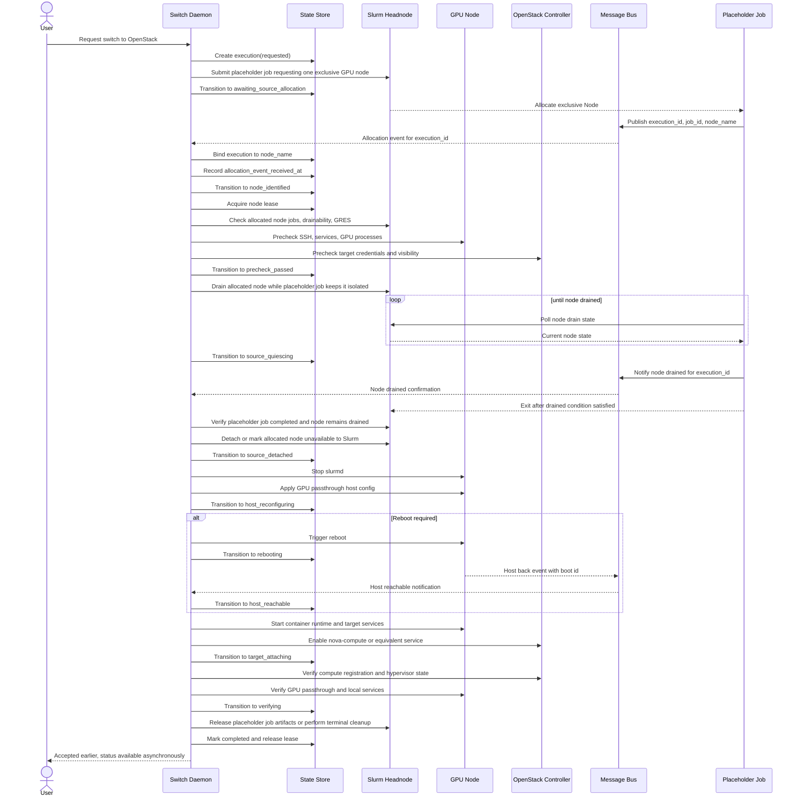
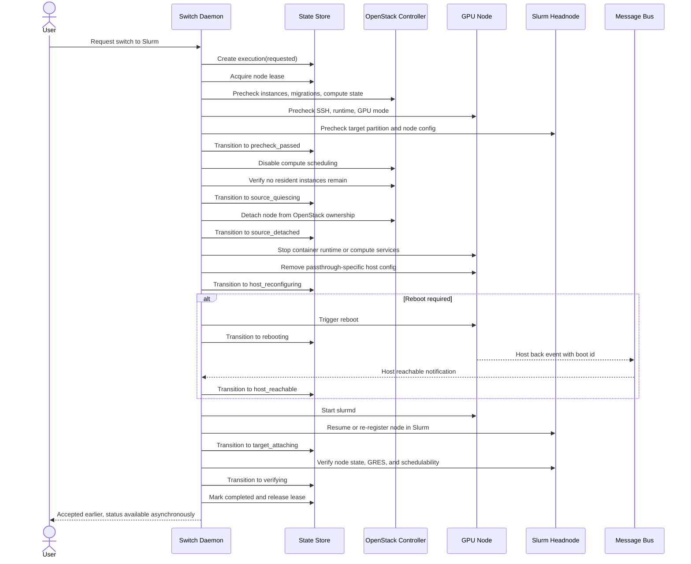
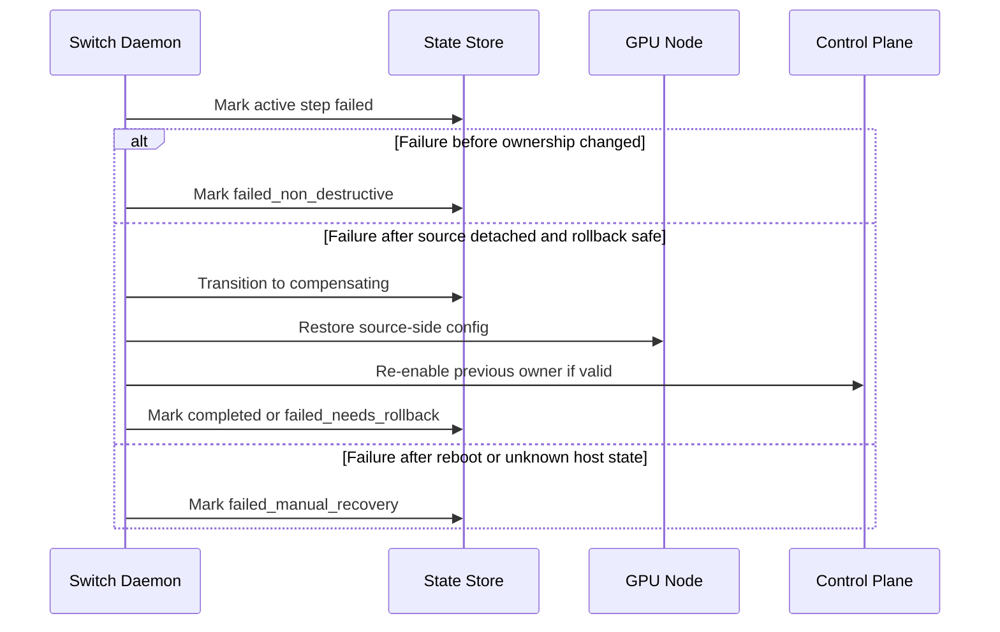

# GPU Node Switching Design

## Goal

Design a daemon-driven mechanism that switches GPU nodes between two compute clusters:

1. Slurm worker
2. OpenStack compute

The design must satisfy four constraints:

1. Switching is asynchronous from the user's perspective.
2. OS-level actions are performed through controlled SSH operations instead of Ansible.
3. Slurm job and node actions use the Slurm API or Slurm control commands.
4. Every execution is observable, replayable, and debuggable when a step fails.

## Non-Goals

This proposal does not define:

1. UI implementation details
2. Exact RabbitMQ topology
3. Exact OpenStack API client library choices
4. Multi-node atomic switching as a single transaction

## Core Design

### Components

1. `Switch Daemon`
    Owns orchestration, state transitions, locking, retries, and execution records.
2. `State Store`
    Persists node ownership, execution records, step records, and lock metadata.
3. `Message Bus`
    Delivers asynchronous events such as execution accepted, host rebooted, and health-check results.
4. `Remote Runner`
    Executes a fixed set of SSH-based host operations through whitelisted commands.
5. `Slurm Control Plane`
    Provides node drain, reservation, job lookup, node state, and GRES visibility.
6. `OpenStack Control Plane`
    Provides compute enable or disable operations and instance or hypervisor visibility.

### Ownership Model

Each GPU node has exactly one desired owner and one observed owner.

- `desired_owner`: `slurm` or `openstack`
- `observed_owner`: `slurm`, `openstack`, `conflict`, or `unknown`

The daemon is the only component allowed to change `desired_owner`.

### Locking Model

Locking is two-phase when the source is Slurm and the target node is not known at request time.

1. A request-scoped execution is created before any node is known.
2. A per-node lease is acquired only after Slurm reveals which node was allocated to the placeholder job.

Every host-level side effect still requires a per-node lease before it starts.

Required lock fields:

1. `node_name`
2. `execution_id`
3. `holder`
4. `lease_expires_at`
5. `state_version`

Rules:

1. Only one active execution may hold the lock for a node.
2. Every event must include `execution_id` and `state_version`.
3. Stale or duplicate events are ignored.
4. A retried request creates a new execution and never resumes implicitly from an old one.
5. A Slurm-to-OpenStack execution may exist without `node_name` until the placeholder job receives an allocation.

## State Machine

The sequence diagram should not be the source of truth. The source of truth is the node switch state machine.

### Node Switch States

1. `requested`
2. `awaiting_source_allocation`
3. `awaiting_target_node`
4. `node_identified`
5. `locked`
6. `precheck_passed`
7. `source_quiescing`
8. `source_detached`
9. `host_reconfiguring`
10. `rebooting`
11. `host_reachable`
12. `target_attaching`
13. `verifying`
14. `completed`
15. `failed_non_destructive`
16. `failed_needs_rollback`
17. `failed_manual_recovery`
18. `compensating`
19. `cancelling`
20. `cancelled`

### State Semantics

1. `requested`
    The user request is accepted but no mutation has started.
2. `awaiting_source_allocation`
    The daemon is waiting for Slurm to allocate an exclusive placeholder job and reveal which node will be switched.
3. `awaiting_target_node`
    The execution is waiting for the MQ-driven node-selection event to bind the request to a specific node (openstack_to_slurm only).
4. `node_identified`
    Slurm has returned the allocated node and the execution is now bound to that node.
5. `locked`
    The daemon has exclusive ownership of the node transition.
6. `precheck_passed`
    Source and target safety checks passed.
7. `source_quiescing`
    The current owner is being drained or disabled.
8. `source_detached`
    The source control plane no longer owns the node.
9. `host_reconfiguring`
    Host-local configuration is changing, such as stopping services or changing GPU mode.
10. `rebooting`
    A reboot was intentionally triggered and loss of SSH is expected.
11. `host_reachable`
    The host is back, reachable, and boot identity changed.
12. `target_attaching`
    The target control plane is being enabled.
13. `verifying`
    End-to-end readiness checks are running.
14. `completed`
    Desired owner and observed owner match and all verification checks passed.
15. `failed_non_destructive`
    The workflow failed before ownership changed.
16. `failed_needs_rollback`
    The workflow failed after mutations and automatic rollback is still possible.
17. `failed_manual_recovery`
    The host or control plane is left in a partial state that requires operator intervention.
18. `compensating`
    The daemon is executing rollback or cleanup actions.
19. `cancelling`
    An operator cancel was accepted; the daemon is performing the direction- and state-specific cleanup before finalizing. The original wait state is recorded as `cancellation_source_state`.
20. `cancelled`
    Cancellation cleanup completed successfully. `overall_status` is `failed` and `final_error_code` is `cancelled_by_user`.

### Safe Cancellation Window

Operator cancellation (`POST /v1/switches/:id/cancel`) is accepted only from these wait states:

| State | Both directions |
|---|---|
| `awaiting_target_node` | Yes |
| `awaiting_source_allocation` | Yes |
| `source_quiescing` | Yes |

All other active states reject cancellation with HTTP 409. These states represent post-detach host mutation or post-reboot recovery where "cancel" would require a real rollback, not just stopping a wait.

Cancellation is idempotent: if an execution is already in `cancelling` or `cancelled`, the endpoint returns HTTP 202 without changing anything.

### Cancellation Cleanup Plans

After the execution enters `cancelling`, the orchestrator runs the appropriate cleanup action based on `cancellation_source_state` and `direction`:

| Source State | Direction | Cleanup |
|---|---|---|
| `awaiting_target_node` | any | No external cleanup; transition directly to `cancelled`. |
| `awaiting_source_allocation` | any | Cancel the placeholder Slurm job (if `placeholder_job_id` is set). |
| `source_quiescing` | `slurm_to_openstack` | Resume the Slurm node, cancel the placeholder job if present, release node lease. |
| `source_quiescing` | `openstack_to_slurm` | Re-enable the OpenStack compute service, release node lease. |

If cleanup fails, the execution transitions to `failed_non_destructive` with `final_error_code=cancel_cleanup_failed`.

## Precheck Requirements

No workflow may start without explicit prechecks.

### Common Prechecks

1. State store is writable.
2. Message bus is reachable.

### Node-Bound Prechecks

These checks run only after the source or target node is known.

1. Node lock is free.
2. Node is not already switching.
3. Node identity matches inventory records.
4. SSH command wrapper is reachable.

### Slurm to OpenStack Prechecks

1. The daemon can submit a placeholder Slurm job that requests one exclusive GPU node.
2. The placeholder job can publish an allocation event to RMQ with `execution_id`, `job_id`, and allocated `node_name`.
3. Slurm returns an allocation for exactly one node.
4. No running Slurm job remains on the allocated node other than the daemon placeholder job.
5. The allocated node can be drained after the placeholder job is in place.
6. GRES state is consistent on the allocated node.
7. No GPU process remains outside Slurm control on the allocated node.
8. OpenStack target registration credentials are available.

### OpenStack to Slurm Prechecks

1. No VM remains on the node.
2. No migration, resize, or evacuation is in progress.
3. Compute service can be disabled cleanly.
4. Hypervisor inventory is consistent.
5. Slurm target partition and node definition are valid.

## Failure Domains

The workflow crosses three failure domains and must record them explicitly.

1. Control plane failure
    Slurm API, OpenStack API, or message bus unavailable.
2. Host mutation failure
    SSH command failed, timed out, or returned inconsistent state.
3. Reboot boundary failure
    Host did not return, returned without expected GPU mode, or target agent never became healthy.

## Failure Taxonomy

Every failed step must map to one of these classes:

1. `transient`
2. `precheck_blocked`
3. `mutation_partial`
4. `verification_failed`
5. `unknown_after_reboot`

## Compensation Strategy

Rollback is step-scoped, not a blind reverse replay.

### Rollback Principles

1. Do not rollback unless the daemon can prove the previous owner is still recoverable.
2. Reboot boundaries must be treated as separate checkpoints.
3. If the daemon cannot prove safe rollback, mark `failed_manual_recovery`.

### Example Compensation Cases

1. Drain failed before node detach
    Mark `failed_non_destructive` and keep source owner unchanged.
2. Slurm detached but GPU mode change failed before reboot
    Attempt source-side service restore, then mark `completed` or `failed_needs_rollback`.
3. GPU mode changed and reboot issued, but host did not return
    Mark `failed_manual_recovery` and retain full execution evidence.
4. OpenStack compute enabled but health check failed
    Disable compute service, collect logs, and either rollback or mark manual recovery.

## Observability and Debuggability

The daemon must persist structured execution data, not only plain text logs.

### Execution Record

Each switch request creates one execution record.

Required fields:

1. `execution_id`
2. `node_name`
3. `request_direction`
4. `requested_by`
5. `requested_at`
6. `current_state`
7. `desired_owner`
8. `previous_owner`
9. `state_version`
10. `overall_status`
11. `lock_acquired_at`
12. `lock_released_at`
13. `final_error_code`
14. `final_error_summary`
15. `log_root`
16. `placeholder_job_id`
17. `requested_slurm_constraint`
18. `requested_slurm_partition`
19. `allocation_event_received_at`

For Slurm-to-OpenStack, `node_name` may be empty while the execution is in `requested` or `awaiting_source_allocation`.

### Step Record

Each state transition or action creates one step record.

Required fields:

1. `execution_id`
2. `step_name`
3. `sequence`
4. `host`
5. `started_at`
6. `ended_at`
7. `status`
8. `retry_count`
9. `exit_code`
10. `error_class`
11. `command_id`
12. `stdout_path`
13. `stderr_path`
14. `snapshot_before_path`
15. `snapshot_after_path`

### Log Layout

Logs must live at a deterministic path:

```text
/var/log/gpu-switch/<node_name>/<execution_id>/
```

Minimum contents:

```text
manifest.json
events.jsonl
steps/precheck.stdout.log
steps/precheck.stderr.log
steps/drain.stdout.log
steps/drain.stderr.log
steps/reboot.stdout.log
steps/reboot.stderr.log
snapshots/pre.json
snapshots/post.json
journal/journal-before.txt
journal/journal-current.txt
journal/journal-previous-boot.txt
```

### What Must Be Captured

For every execution:

1. User request payload
2. Derived plan
3. State transitions
4. All SSH command invocations with duration and exit code
5. All Slurm API or CLI requests and responses
6. All OpenStack API requests and responses
7. Message publish and consume events with correlation metadata
8. Host boot ID before and after reboot
9. Verification results
10. Placeholder job lifecycle, including allocation event and drain-wait completion

### Host Snapshots

The daemon should capture structured snapshots before mutation and after final verification.

Snapshot contents should include:

1. Hostname and management IP
2. Current boot ID
3. Kernel command line
4. Loaded GPU-related kernel modules
5. PCI device inventory for GPU functions
6. Running GPU processes
7. Slurm node state and GRES visibility
8. OpenStack compute service and hypervisor visibility
9. Docker or container runtime status if OpenStack mode depends on it
10. Relevant systemd service states

### Reboot Diagnostics

Reboot is the most likely hard-to-debug boundary. The daemon should always collect:

1. `journalctl -b` before issuing reboot when possible
2. `journalctl -b` after the new boot
3. `journalctl -b -1` after the new boot
4. `dmesg` after reboot
5. Service logs for `slurmd`, `docker` or runtime, `nova-compute`, `libvirtd`, and any GPU setup unit

## Remote Execution Safety

Using SSH is reasonable only if command scope is constrained.

### Required Controls

1. No interactive shell access for the daemon identity.
2. Only a fixed command wrapper may be executed with `sudo`.
3. Each wrapper command validates parameters and emits structured JSON output.
4. Every wrapper invocation is tagged with `execution_id` and `step_name`.
5. Shell command text is recorded for audit.

## Idempotency Rules

The daemon must be safe under duplicate delivery and retried requests.

1. `request switch node X to owner Y` is idempotent only if the same execution is retried.
2. A later execution for the same node must fail if an earlier lease is still active.
3. Consumed MQ events must be rejected if `execution_id` or `state_version` does not match the active execution.
4. Enabling a target service must verify current state before mutating it.

## Verification Gates

The workflow is complete only when verification succeeds.

### Slurm Ownership Verification

1. `slurmd` is active.
2. Node is registered in Slurm.
3. Node state is schedulable or intentionally drained for policy reasons.
4. GRES reports the expected GPU devices.
5. No OpenStack compute service remains enabled for the node.

### OpenStack Ownership Verification

1. Target runtime services are active.
2. `nova-compute` is registered and enabled.
3. Hypervisor inventory is visible.
4. GPU PCI passthrough related configuration matches expectation.
5. Slurm node is drained or detached and no longer available for new jobs.

## Primary Workflow

The daemon runs the same high-level pipeline in both directions.

1. Accept request
2. Resolve or obtain the target node from the source control plane if the node is not known yet
3. Acquire node lock
4. Run node-bound prechecks
5. Reserve or isolate the source node if the source control plane requires it
6. Quiesce source owner
7. Detach source owner
8. Reconfigure host
9. Reboot if required
10. Attach target owner
11. Verify target readiness
12. Release lock and finalize execution

## Slurm Reservation Semantics

For Slurm to OpenStack transitions, the daemon does not know the target node at request time. It must first ask Slurm for one exclusive GPU node and then bind the execution to the node that Slurm allocates.

The placeholder job is part of the control flow, not only a reservation primitive.

1. Slurm allocates one exclusive node to the placeholder job.
2. The placeholder job discovers its allocated `node_name` locally.
3. The placeholder job publishes that allocation to RMQ for the switch daemon.
4. The placeholder job stays alive and keeps polling Slurm node state.
5. The placeholder job exits as soon as the node reaches `DRAIN` or another configured drained terminal condition.

The placeholder job does not stay alive across host reconfiguration, reboot, or OpenStack service bring-up. Once drained is confirmed, its control-plane role is complete.

After Slurm reveals the allocated node, the daemon must keep that node reserved inside Slurm until detach starts and the execution has taken over ownership.

This reservation exists to satisfy two requirements:

1. Let Slurm pick an eligible node instead of requiring the user or daemon to name one up front.
2. Prevent new user jobs from landing on the allocated node during the switch window.
3. Give the daemon a control-plane-backed claim on the allocated node before host mutation begins.
4. Provide an in-band worker-side signal that tells the daemon which node was actually allocated.

Accepted mechanisms:

1. A placeholder batch job with exclusive node allocation.
2. A Slurm reservation scoped only to the target node and owned by the daemon.

For the Slurm-to-OpenStack flow in this proposal, the placeholder batch job is the primary mechanism.

Required properties:

1. The claim must be exclusive.
2. The initial Slurm request must be able to run without knowing `node_name` in advance.
3. Once allocation occurs, the claim must be attributable to the current `execution_id` and allocated `node_name`.
4. The claim must be released when the switch completes, rolls back, or times out.
5. The daemon must verify that no other Slurm job can be scheduled onto the node after the claim is established.
6. The placeholder job must emit an RMQ allocation event before any node-bound daemon action begins.
7. The placeholder job must keep polling until the node is drained, so the daemon can distinguish "allocated but not yet drained" from "placeholder job ended unexpectedly".
8. After the drained condition is observed and reported, the placeholder job should exit normally before any reboot-sensitive host mutation begins.

The switch must not proceed to node-bound prechecks, SSH checks, drain, or detach until the placeholder allocation has completed and the allocated node is known.

## Slurm Worker to OpenStack Compute



## OpenStack Compute to Slurm Worker



## Failure Handling Sequence



## Operator-Facing Debug Model

An operator should be able to answer four questions for any failed switch:

1. Which step failed?
2. What changed before the failure?
3. Is the node still owned by the source, already partly switched, or unknown?
4. What evidence should be inspected next?

The system should expose:

1. Execution summary
2. Step timeline
3. Raw stdout and stderr per step
4. Snapshot diff before and after mutation
5. Final recovery classification

## Open Questions

These must be decided before implementation:

1. What exact host change toggles GPU mode between Slurm and OpenStack on this hardware platform?
2. Is reboot always required, or only for some transitions?
3. How is host reachability after reboot detected: MQ heartbeat, SSH polling, or both?
4. What is the authoritative inventory source for node identity and management IP?
5. What is the maximum allowed time per state before timeout and escalation?
6. Which actions are safe for automatic retry and which require operator approval?

## Recommended Next Artifact

The next step should not be more sequence work. It should be a concrete state-and-log specification containing:

1. Execution record schema
2. Step record schema
3. State transition table
4. Timeout and retry policy per state
5. Rollback matrix per failed step